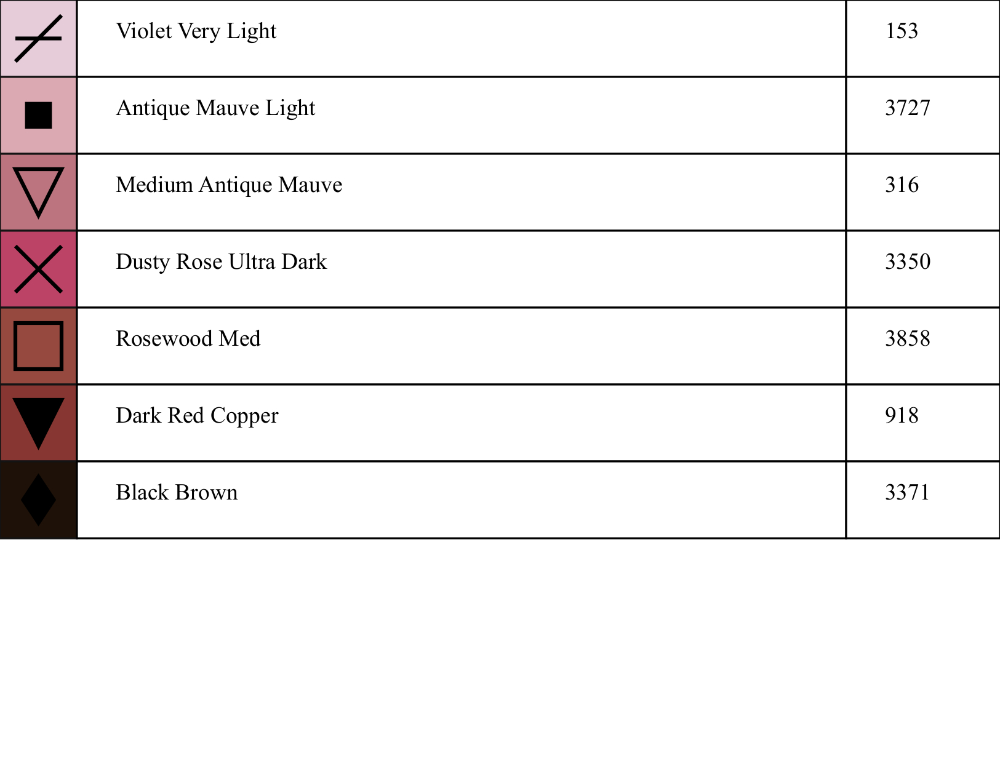

# Tarraz | طرّاز
A cross-stitch image generator.
Generates a cross stitch pattern from an image of your choice. The generated pattern is DMC colored.

Takes an image file and generates a cross stitch pattern using a user specified color..

## Supported image extensions
1. JPEG (.jpg, .jpeg)
2. PNG (.png)
3. WebP (.webp)

## Current color providers
1. DMC

## Results

Photo by <a href="https://unsplash.com/@studiokiek?utm_source=unsplash&utm_medium=referral&utm_content=creditCopyText">Kiki Siepel</a> on <a href="https://unsplash.com/images/nature/flower?utm_source=unsplash&utm_medium=referral&utm_content=creditCopyText">Unsplash</a>

### Colored with Symbols


### Black White with Symbols


### Colored


### Keys



## Usage
### Installation
```
pip install tarraz
```

### Example
```
python tarraz/main.py .tmp/palestinian_flag.jpg --colors 6 --stitches-count 100
```

### Options
```
python tarraz/main.py --help
usage: main.py [-h] [-v] [-c COLORS] [-n STITCHES_COUNT] [-w WIDTH] [-m DMC] [-t TRANSPARENT [TRANSPARENT ...]]
               [-s DIST] [-z CELL_SIZE] [--no-cleanup] [--svg]
               image

Generate a DMC-colored cross-stitch pattern from a given image.

positional arguments:
  image                 Input image

optional arguments:
  -h, --help            show this help message and exit
  -v, --version         show program's version number and exit
  -c COLORS, --colors COLORS
                        Number of colors to use in the pattern.
  -n STITCHES_COUNT, --stitches-count STITCHES_COUNT
                        Number of stitches to use in the x axis.
  -w WIDTH, --width WIDTH
                        Result pattern width.
  -m DMC, --dmc DMC     DMC json color path.
  -t TRANSPARENT [TRANSPARENT ...], --transparent TRANSPARENT [TRANSPARENT ...]
                        A Color to ignore from the end result.
  -s DIST, --dist DIST  DMC json color path.
  -z CELL_SIZE, --cell-size CELL_SIZE
                        The size of the generated Aida fabric cell.
  --no-cleanup          Don't run cleanup job on generated image.
  --svg                 Export result to svg files.
```
 